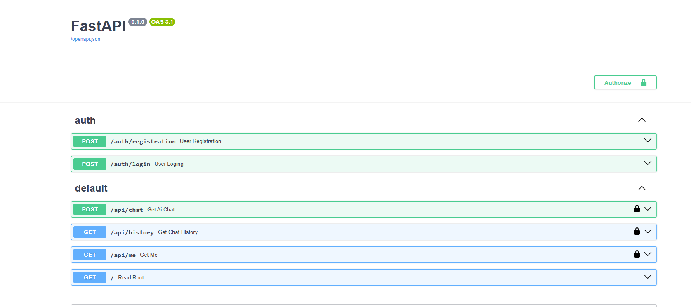
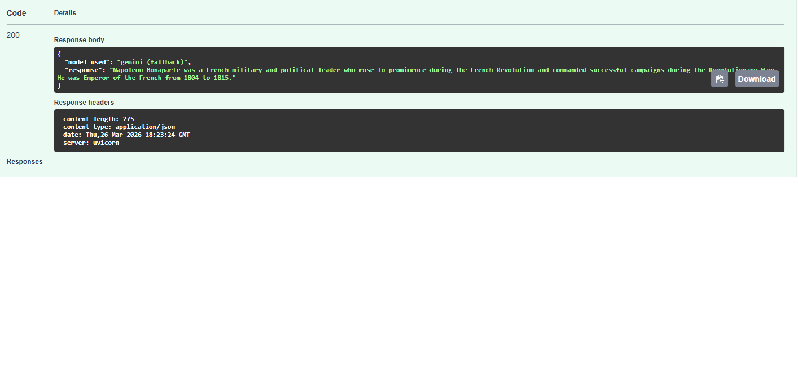

AI Chat API (FastAPI + JWT + Hybrid AI)
This is a high-performance Backend API built with FastAPI. It features a robust user authentication system and a smart AI chat interface. The standout feature of this project is its Intelligent Fallback Mechanism, ensuring the chat remains functional even if one AI provider hits its limits.

🌟 Key Features
Hybrid AI Strategy: Seamlessly integrates both OpenAI GPT and Google Gemini.

Intelligent Fallback: If the OpenAI service returns a "Quota Exceeded" error (429), the system automatically reroutes the request to Gemini. The user never sees a failure.

Secure JWT Authentication: Full registration and login flow using JSON Web Tokens and password hashing with bcrypt.

Persistent Conversation History: All messages are stored in a SQLite database via SQLAlchemy ORM, providing users with their past chat context.

Modern Tooling: Managed with uv, the next-generation Python package manager, for reproducible and fast environments.
## 📸 Preview

### 1. API Documentation (Swagger UI)

### 2. Smart AI Response

🛠 Tech Stack
Framework: FastAPI

Database: SQLite & SQLAlchemy (ORM)

Security: JWT (python-jose), Passlib (bcrypt)

AI SDKs: openai SDK, google-genai

Environment: Pydantic Settings (BaseSettings)

Package Manager: uv

🔒 Security & Authorization
This project follows the OAuth2 standard with Password flow and Bearer tokens.

Users register via /auth/registration.

Users receive a JWT Access Token upon a successful login at /auth/login.

The token is required for all /api/ endpoints, ensuring that users can only access their own private chat history.

⚙️ Installation & Setup
Clone the repository:

Bash
git clone https://github.com/YOUR_USERNAME/YOUR_REPO_NAME.git
cd YOUR_REPO_NAME
Install dependencies:
Using uv (recommended):

Bash
uv sync
Or via pip:

Bash
pip install -r requirements.txt
Environment Configuration:
Create a .env file in the root directory and add your credentials:

Code snippet
GEMINI_API_KEY=your_google_api_key
CHAT_GPT_API_KEY=your_openai_api_key
SECRET_KEY=your_random_secret_string
ALGORITHM=HS256
Run the application:

Bash
uvicorn app.main:app --reload
